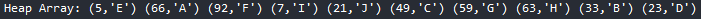
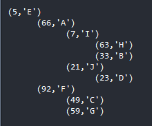

# MinMaxHeap
A MinMax heap is a complete binary tree data structure which combines the usefulness of both a min-heap and a max-heap. A min-max heap contains alternating min (or even) and max (or odd) levels. Even levels are for example 0, 2, 4, etc, and odd levels are respectively 1, 3, 5, etc. The root element is at the first level, i.e., 0 and contains the smallest element of the tree. One of the two elements in the second level, which is a max (or odd) level, is the greatest element in the min-max heap.

<b> The time complexities of a normal MinMax Heap are as follows: </b>

 &emsp; &emsp; &emsp; &ensp; Average &emsp; Worst 

 &emsp; Insert &ensp; O(log n)	&emsp;O(log n) 

 &ensp; Delete &ensp; O(log n) &emsp;[1]	O(log n) 

However this implementation works in 0(1) time by having functions tickle which first determines whether the item will be on a min or max level and then call the appropriate tickle function (Min/Max) which both run on a Min Heap or Max heap in 0(1) time. 

For more information on MinMax Heaps continue reading <a href = "https://en.wikipedia.org/wiki/Min-max_heap">here</a>

## What you will find in this code
This implementation of a MinMax Heap can perform the following operations:
1. Insert
2. Find Minimum
3. Find Maximum
4. Remove Minimum
5. Remove Maximum

This code also includes a test to ensure the MinMax Heap follows all the conditions of a MinMax Heap. This includes:
1. Ensuring the root is the minimum
2. The max can be found on the 2nd level
3. Every level is alternating between Even/Min and Odd/Max
4. And using brute force to ensure that every node is where it should be

This code also includes functions which print out visualizations of the Heap in a Array form and in a tree form. 
Which looks like the following respectively:

 

 This Heap is read, left to right, in that the top left is the root node (5, 'E'). 

 The next indented level is the 2nd level of the heap which in this case is (66, 'A') and (92, 'F'). 

 The next indented level is the 3rd level which has 2 mini trees for (66, 'A') and (92, 'F'). 

 For (66, 'A') this includes (7, 'I') and (21, 'J'), and for (92,'F') this includes (49,'C') and (59,'G'). And so on. 

